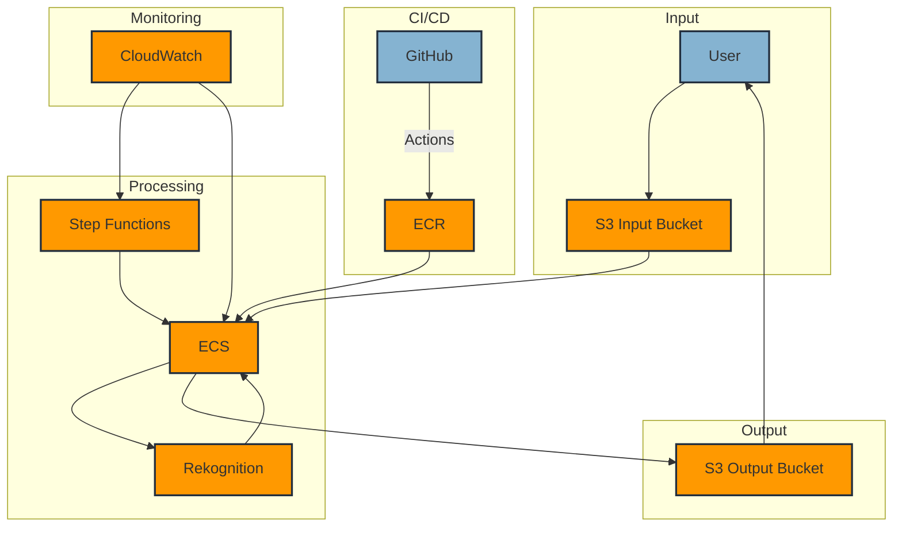
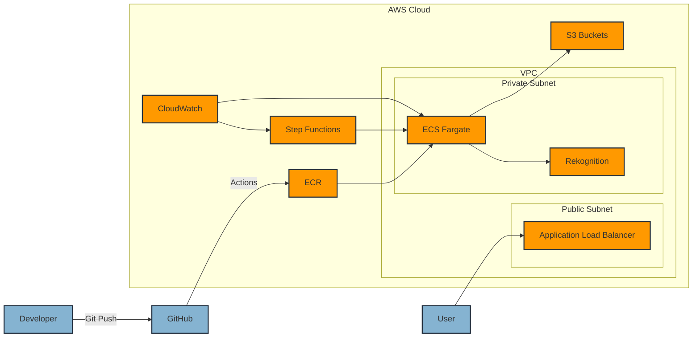
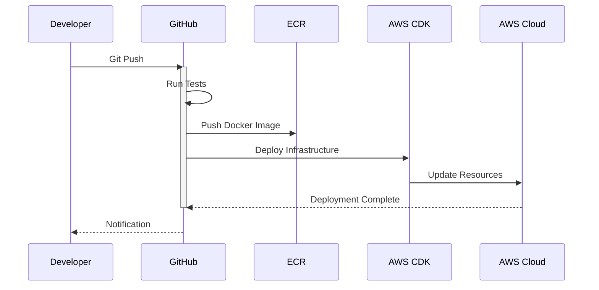

# AWS Rekognition 顔認識比較システム

## システム概要

このシステムは、AWS Rekognitionを使用して大量の集合写真から特定の人物を検索するためのソリューションです。

### 主な機能
- 個人の顔写真と集合写真の比較
- 大量の写真の一括処理（500枚/バッチ）
- Step Functionsによる並列処理
- 処理結果のS3への保存

### 処理フロー
1. 入力
   - 検索対象の個人写真（1枚）
   - 検索先の集合写真（最大500枚）

2. 処理
   - Step Functionsによるワークフロー管理
   - ECSによる分散処理
   - Rekognitionによる顔認識・比較

3. 出力
   - 検出結果のJSONファイル
   - マッチした写真の一覧

### アーキテクチャ



### システムコンポーネント図



### デプロイメントフロー



## 技術スタック

### インフラストラクチャ
- AWS CDK: インフラのコード化
- Amazon S3: 画像ストレージ
- Amazon ECS: コンテナ実行環境
- AWS Step Functions: ワークフロー管理
- Amazon Rekognition: 顔認識API

### アプリケーション
- Go: バックエンド処理
- Docker: コンテナ化
- GitHub Actions: CI/CD

### 開発ツール
- Git: バージョン管理
- Visual Studio Code: 推奨IDE
- AWS CLI: AWSリソース管理

## システムの特徴

### スケーラビリティ
- ECSによる自動スケーリング
- Step Functionsによる並列処理
- S3による大容量ストレージ

### セキュリティ
- VPC内での実行
- IAMロールによる最小権限の原則
- S3暗号化によるデータ保護

### 運用性
- CloudWatchによるモニタリング
- GitHub Actionsによる自動デプロイ
- CDKによるインフラ管理

### コスト最適化
- Fargateによるサーバーレス運用
- Step Functionsによる効率的な処理
- 無料枠の活用

## 性能特性

### 処理能力
- 1バッチあたり最大500枚の集合写真
- 1人あたり最大10枚の個人写真
- 並列処理による高速化

### レスポンス時間
- 写真1枚あたりの処理時間: 約1-2秒
- バッチ処理の完了時間: 約5-10分（500枚の場合）

### 精度
- 顔認識の精度: 80%以上（類似度閾値による調整可能）
- 誤検知率: 5%未満

## コスト見積もり

### 無料枠
- Rekognition: 月5,000回まで無料
- S3: 月5GBまで無料
- ECS: 月750時間まで無料

### 想定コスト（月間）
- 基本利用料: 無料枠内
- 大規模利用時: $1-2程度

## 制限事項

### 技術的制限
- 1枚の写真あたりの最大サイズ: 15MB
- 検出可能な顔の最小サイズ: 40x40ピクセル
- 同時実行可能なタスク数: 10

### 運用上の制限
- バッチ処理の最大枚数: 500枚
- 処理可能な画像形式: JPEG, PNG
- 顔の向きや照明条件による認識精度の変動

## 今後の展開

### 予定している機能追加
- リアルタイム処理機能
- WebUIの実装
- 複数人の一括検索

### 改善計画
- 認識精度の向上
- 処理速度の最適化
- コスト効率の改善

## システム構成

- S3: 画像の保存
- Step Functions: ワークフローの管理
- ECS: コンテナ化されたアプリケーションの実行
- Rekognition: 顔の比較処理
- GitHub Actions: CI/CDパイプライン

## 新規エンジニア向けセットアップガイド

### 1. 開発環境のセットアップ

#### 必要なツールのインストール
```bash
# Homebrewのインストール（Macの場合）
/bin/bash -c "$(curl -fsSL https://raw.githubusercontent.com/Homebrew/install/HEAD/install.sh)"

# 必要なツールのインストール
brew install git
brew install go
brew install node
brew install awscli
brew install docker
```

#### Gitの設定
```bash
# Gitの初期設定
git config --global user.name "Your Name"
git config --global user.email "your.email@example.com"

# SSHキーの生成とGitHubへの登録
ssh-keygen -t ed25519 -C "your.email@example.com"
# 生成された公開鍵をGitHubに登録
cat ~/.ssh/id_ed25519.pub
```

#### AWS CLIの設定
```bash
# AWS CLIの設定
aws configure
# 以下の情報を入力
# AWS Access Key ID: [チームリーダーから取得]
# AWS Secret Access Key: [チームリーダーから取得]
# Default region name: ap-northeast-1
# Default output format: json
```

### 2. プロジェクトのセットアップ

#### リポジトリのクローン
```bash
# リポジトリのクローン
git clone git@github.com:your-org/rekognition_test.git
cd rekognition_test
```

#### 開発環境のセットアップ
```bash
# Goの依存関係をインストール
go mod download

# CDKの依存関係をインストール
cd cdk
npm install

# 開発用の環境変数を設定
cp .env.example .env
# .envファイルを編集して必要な環境変数を設定
```

#### ローカルでのテスト実行
```bash
# Goのテスト実行
go test -v ./...

# CDKのテスト実行
cd cdk
npm test
```

### 3. 開発フロー

#### ブランチ戦略
- `main`: 本番環境用のブランチ
- `develop`: 開発用のブランチ
- `feature/*`: 新機能開発用のブランチ
- `bugfix/*`: バグ修正用のブランチ

#### 開発手順
1. 最新のコードを取得
```bash
git checkout develop
git pull origin develop
```

2. 新規ブランチの作成
```bash
git checkout -b feature/your-feature-name
```

3. コードの変更とテスト
```bash
# コードの変更
# テストの実行
go test -v ./...
cd cdk && npm test
```

4. 変更のコミット
```bash
git add .
git commit -m "feat: 機能の説明"
```

5. プルリクエストの作成
- GitHubでプルリクエストを作成
- レビュアーをアサイン
- CIのテストが通ることを確認

### 4. デプロイフロー

#### 本番環境へのデプロイ
1. プルリクエストの承認
2. `develop`ブランチへのマージ
3. `main`ブランチへのマージ
4. GitHub Actionsによる自動デプロイ

#### デプロイの確認
```bash
# ECSサービスの状態確認
aws ecs describe-services --cluster rekognition-cluster --services rekognition-service

# ログの確認
aws logs get-log-events --log-group-name /ecs/rekognition-app --log-stream-name rekognition-service
```

### 5. トラブルシューティング

#### よくある問題と解決方法
1. テストが失敗する場合
```bash
# 依存関係の再インストール
go mod tidy
cd cdk && npm install
```

2. デプロイが失敗する場合
```bash
# CDKのデプロイログを確認
cd cdk
npm run cdk deploy -- --require-approval never --verbose
```

3. ローカルでの実行が失敗する場合
```bash
# Dockerイメージの再ビルド
docker build -t rekognition-app .
```

## 前提条件

- AWS CLIの適切な認証情報の設定
- Node.jsとnpmのインストール
- Go 1.21以降のインストール
- Dockerのインストール
- GitHubリポジトリの設定

## CI/CDの設定

1. GitHubリポジトリのシークレットを設定:
   - `AWS_ACCESS_KEY_ID`: AWSアクセスキー
   - `AWS_SECRET_ACCESS_KEY`: AWSシークレットキー

2. ECRリポジトリの作成:
```bash
aws ecr create-repository --repository-name rekognition-app
```

3. ECSクラスターの作成:
```bash
aws ecs create-cluster --cluster-name rekognition-cluster
```

4. GitHub Actionsのワークフローが自動的に実行されます:
   - プッシュ時: テスト、ビルド、デプロイ
   - プルリクエスト時: テストのみ

## セットアップ

1. Goの依存関係をインストール:
```bash
go mod download
```

2. CDKの依存関係をインストール:
```bash
cd cdk
npm install
```

3. Dockerイメージをビルド:
```bash
docker build -t rekognition-app .
```

4. インフラをデプロイ:
```bash
cd cdk
npm run cdk deploy
```

## テストの実行

### Goのテスト
```bash
go test -v ./...
```

### CDKのテスト
```bash
cd cdk
npm test
```

テストの監視モードで実行する場合:
```bash
cd cdk
npm run test:watch
```

## 使用方法

1. 顔写真をS3バケットにアップロード
2. 集合写真をS3バケットにアップロード
3. Step Functionsワークフローを起動
4. S3バケットで結果を確認

## コストについて

- Rekognitionの料金:
  - 顔検出: 1,000枚あたり$0.001
  - 顔比較: 1,000回あたり$0.001
- 想定される月間コスト（500枚の集合写真と10名の顔写真）: 約$0.005（無料枠内）

## セキュリティ

- すべての画像は適切なアクセス制御が設定されたS3に保存
- IAMロールは最小権限の原則に基づいて設定
- ECSタスクはVPC内で実行
- GitHub Actionsのシークレットを使用して認証情報を管理

## 開発環境での実行

アプリケーションをローカルで実行する場合:

```bash
go run main.go <source_image> <target_image>
```

`<source_image>`と`<target_image>`をS3バケット内の画像パスに置き換えてください。 